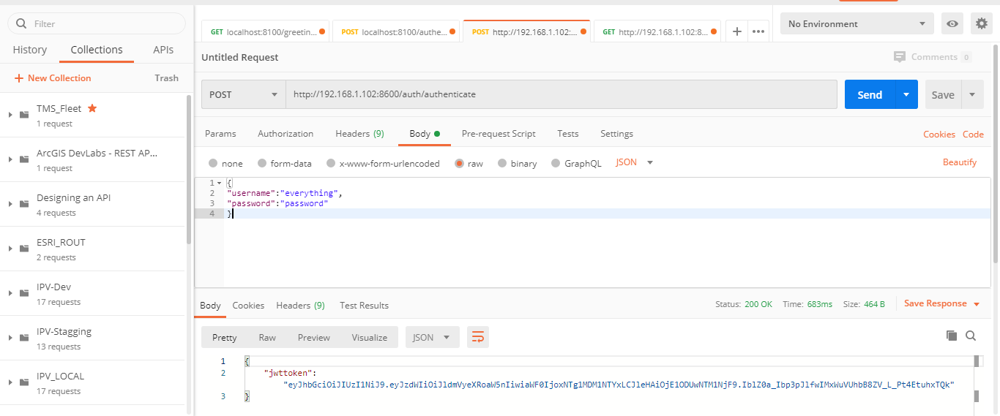

# Product Ordering - MicroServices

	This repository has basic code related to MicroService in spring boot. 
	- Creation of MicroServices
	- Intercommunication in between MicroServices
	- Authorization of Micro by JWT
	- Dockerization of MicroServices
	- Docker-Compose in MicroServices

# Technologies

	- Java 8
	- lombok
	- Spring Boot
	- Maven
	- H2 (With the Dev profile you can use H2, but with the Prod Profile you need to use MySQL)
	- Tomcat
	- JWT
	- Docker, Docker-compose

### Components
	  - API Gateway
	  - Discovery Server
	  - Auth Service
	  - Order service
	  - Product Service

## Commands to build and run 
	- mvn clean install 
	- docker-compose up --build
	- docker-compose up  --force-recreate --build

## Configuration 
  Port for each Service should be unique. Spring Boot
  
## Service Endpoints
	 - http://localhost:8766
	 - http://localhost:8300
## Edge Gateway URL
	 - http://localhost:8600/product-service
	 - http://localhost:8600/order-service
	 
## Authentication URL direct
	- http://localhost:8100/authenticate
		{
		"username":"everything",
		"password":"password"
		}
		
		pass request with  Authorization: Bearer
## Authentication with ZUUL

	 http://192.168.1.102:8600/auth/authenticate
	 http://192.168.1.102:8600/auth/greetings

## TODO
	- Authentication
	- Test case
	- JWT integration

